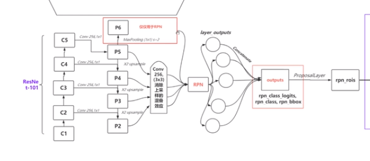
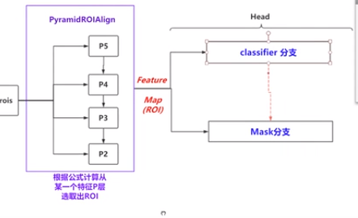

# Mask RCNN

---

>参考资料
>
>[令人拍案称奇的Mask RCNN](<https://zhuanlan.zhihu.com/p/37998710>)
>
>[知乎：如何评价 Kaiming He 最新的 Mask R-CNN?](<https://www.zhihu.com/question/57403701>)
>
>[实例分割--Mask RCNN详解](<https://blog.csdn.net/qinghuaci666/article/details/80900882>)
>
>[B站视频：Mask R-CNN 深度解读与源码解析](<https://www.bilibili.com/video/av24795835?from=search&seid=5700274980241297444>)
>
>论文：
>
>《[Feature Pyramid Networks for Object Detection](https://arxiv.org/abs/1612.03144)》
>
>《Mask R-CNN》
>
>源码：
>
>[[matterport]/**Mask_RCNN**](<https://github.com/matterport/Mask_RCNN>)

---

算法需要解决四个问题，其一是图像分类 (image classification)，主要回答是什么的问题，其二是定位 (localization)，主要回答在哪里的问题，其三是mask classification，即对图像中每个像素做分类，进一步回答了在哪里的问题，其四是关键点定位，在进一步回答在哪里的同时也包含了更多是什么的信息。

## 基本架构

ResNet-FPN+Fast RCNN+mask

主要的改进点：

1. 基础网络的增强：FPN
2. 分割loss的改进：由原来的 FCIS 的 基于单像素softmax的多项式交叉熵变为了基于单像素sigmod二值交叉熵
3. ROI Align层的加入
4. 添加并列的FCN层，即Mask层

### FPN

引入FPN是对主干网络的主要扩展

FPN产生了特征金字塔 $[P2,P3,P4,P5,P6]​$，而并非只是一个feature map。金字塔经过RPN之后会产生很多region proposal

Top-Down + Bottom-Up

FPN结构中包括自下而上，自上而下和横向连接三个部分

1. 自下而上

特征提取的过程

2. 自上而下

从最高层开始进行上采样，采用最近邻上采样而不是反卷积，既简单又可以减少训练参数

3. 横向连接

将上采样的结果和自底向上的相同大小的feature map进行融合；

具体就是经过1*1卷积之后，和上采样的feature map进行整合；

融合之后还要采用3*3卷积对融合特征进行处理，目的是消除混叠

> **上图少绘制了一个分支**：M5经过步长为2的max pooling下采样得到 P6，作者指出使用P6是想得到更大的anchor尺度512×512。但P6是只用在 RPN中用来得到region proposal的，并不会作为后续Fast RCNN的输入。
>
> ResNet-FPN作为RPN输入的feature map是P2~P6 ，而作为后续Fast RCNN的输入则是P2~P5

根据经验公式来决定不同尺度的ROI要从哪个$P_k​$来切

大尺度的ROI要从低分辨率的feature map上切，有利于检测大目标，小尺度的ROI要从高分辨率的feature map上切，有利于检测小目标

### Mask分支

[FCN](<https://zhuanlan.zhihu.com/p/22976342>)

与FasterRCNN相比，Mask-RCNN多了一个分支；Mask-RCNN将RCNN拓展到语义分割领域

Mask-RCNN的实现是FCN网络，掩码分支实际就是一个卷积网络，选择ROI分类器的正样本作为输入，生成对应的掩码

网络架构：

1. 骨干网络ResNet-FPN，用于特征提取，另外，ResNet还可以是：ResNet-50,ResNet-101,ResNeXt-50,ResNeXt-101；
2. 头部网络，包括边界框识别（分类和回归）+mask预测。头部结构见下图

Mask RCNN定义多任务损失：$L=L_{cls}+L_{box}+L_{mask}​$

### ROI Align

Faster RCNN 中采用的是ROI pooling 特征图和原始图并不是对准的，misalignment

1. 双线性插值：本质是在两个方向做线性插值

虚线表示feature map；实线表示ROI；这里将ROI分成2*2的单元格

如果采样点是4，那么首先将每个单元格分成4块，每块的中心点就是采样点

对每个采样点就行双线性插值，得到采样点处的值；

然后对每个单元格中的4个采样点进行maxpooling

### 损失函数

$$ L=L_{cls}+L_{box}+L_{mask}$$

损失函数 = 分类损失+检测损失+分割损失

假设一共有K个类别，则mask分割分支的输出维度是 $K*m*m$ , 对于 中$m*m​$的每个点，都会输出K个二值Mask（每个类别使用sigmoid输出）

> 计算loss的时候，并不是每个类别的sigmoid输出都计算二值交叉熵损失，而是该像素属于哪个类，哪个类的sigmoid输出才要计算损失(如图红色方形所示)
>
> 并且在测试的时候，我们是通过分类分支预测的类别来选择相应的mask预测。这样，mask预测和分类预测就彻底解耦了
>
> 通过对每个 Class 对应一个 Mask 可以有效避免类间竞争

## 源码阅读

> B站视频
>
> [[matterport]/**Mask_RCNN**](<https://github.com/matterport/Mask_RCNN>): Keras + Tensorflow实现
>
> [maskrcnn-benchmark](<https://github.com/facebookresearch/maskrcnn-benchmark>): pytorch 1.0 ， 包含faster rcnn

学习mask rcnn loss的计算

## 拓展 Mask Scoring R-CNN

[Mask Scoring R-CNN](<https://blog.csdn.net/weixin_40955254/article/details/88605164>)

[CVPR2019:Mask Scoring R-CNN](<https://zhuanlan.zhihu.com/p/58291808>)

