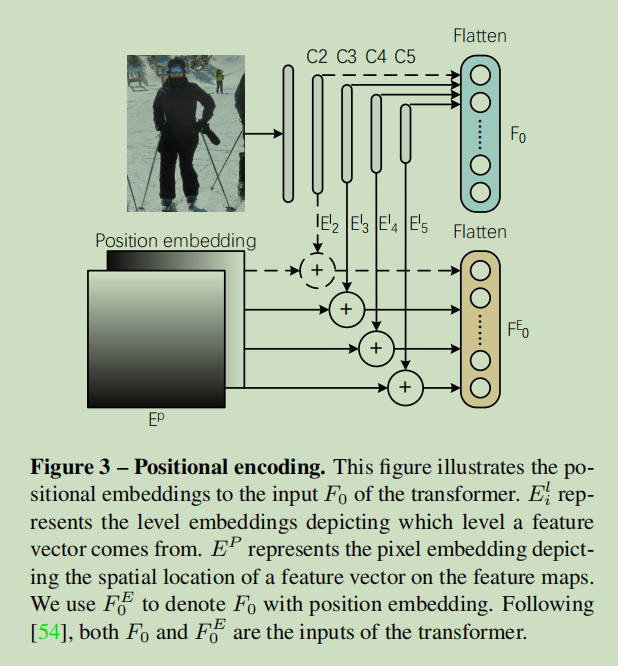
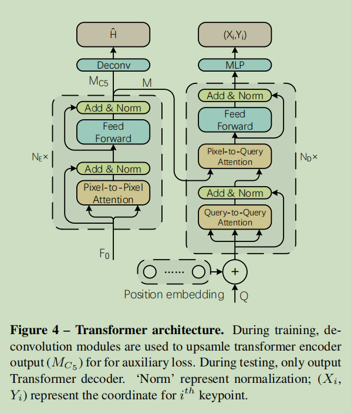
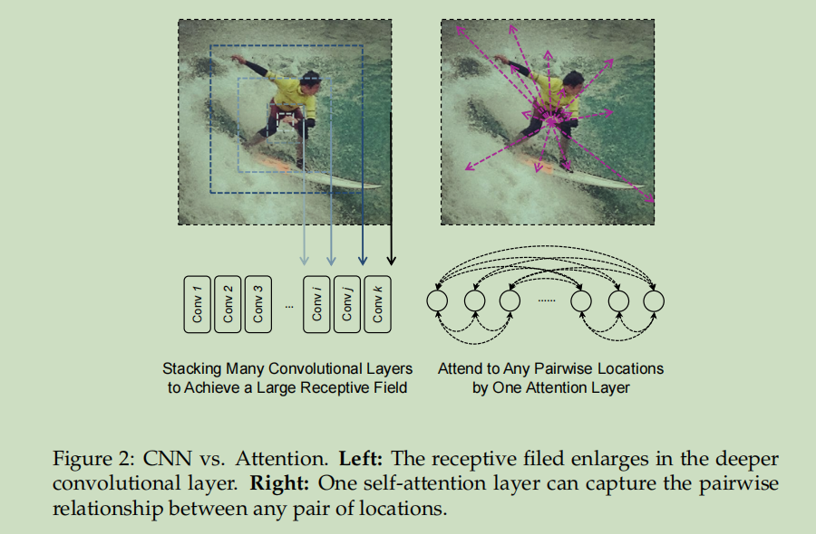
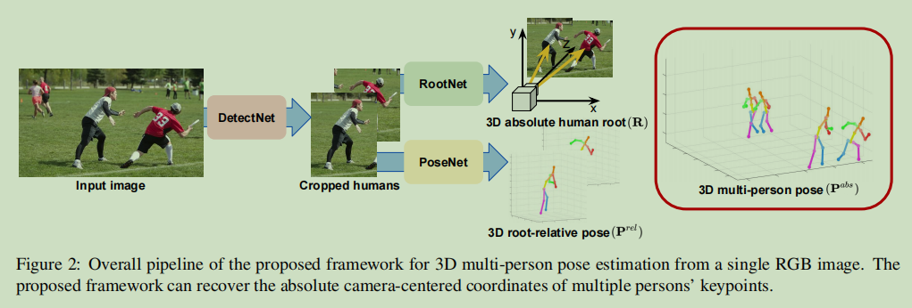
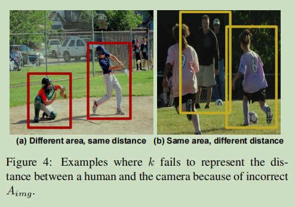
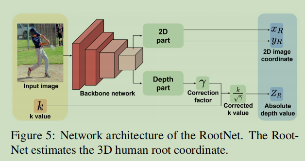
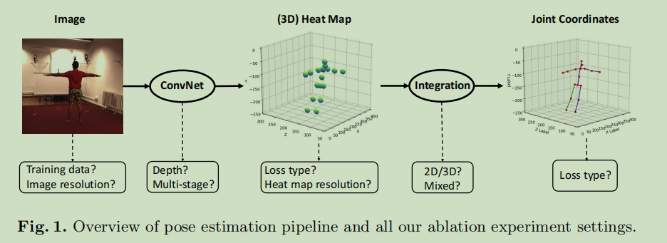
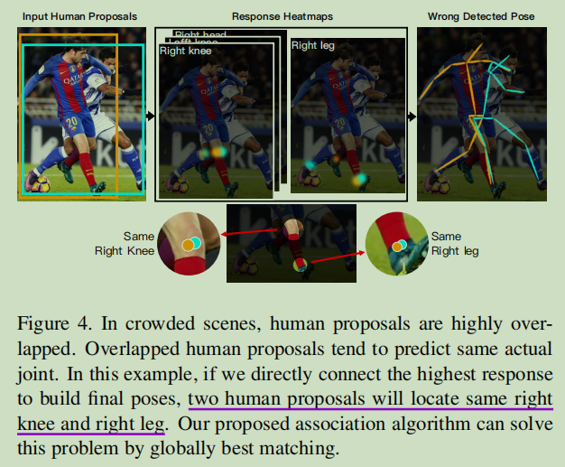
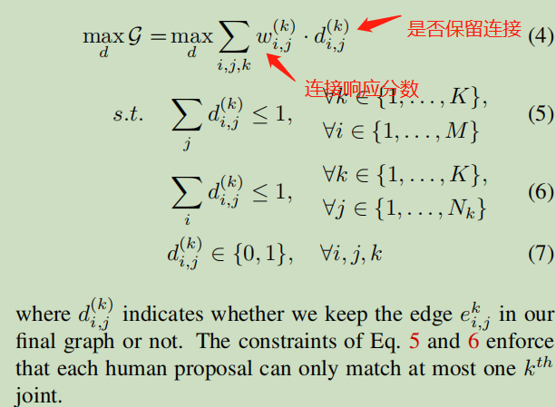
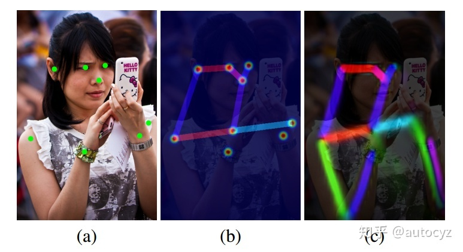

# 人体姿态估计论文-4月

## Transformer

### 20210420：《AN IMAGE IS WORTH 16X16 WORDS: TRANSFORMERS FOR IMAGE RECOGNITION AT SCALE》
### 20210420：《Swin Transformer: Hierarchical Vision Transformer using Shifted Windows》

......

## Transformer之人体姿态

### 20210406：《**TFPose: Direct Human Pose Estimation with Transformers**》

代码：[AdelaiDet](https://github.com/aim-uofa/AdelaiDet/)(无效)

https://git.io/AdelaiDet

作者总结fc方法差于hmp方法的几个原因：

1. DeepPose：全局平均池化破坏了卷积特征层的空间结构
2. DirectPose：卷积特征和预测是非对齐的（*待阅读对齐机制。。。*）
3. 回归方法只回归坐标，并没有考虑结构关联

作者将transformer引入到keypoints问题中，将K个关节点预测转化为K维度的seq2seq问题

作者将fc模型效果提升到了heatmap方法的水平

作者自称有如下优点：

1. 不使用平均池化
2. 避免特征不对齐问题：多路注意机制
3. 以序列化方式捕捉关键点之间结构依赖

对于对称模式，图8展示了第三个解码器层中所有对称关节对之间的相关性。对于相邻的模式，图9明确地显示了相邻的关节在第二个解码器层中相互连接

### 20210407：《TransPose: Towards Explainable Human Pose Estimation by Transformer》

代码：[yangsenius](https://github.com/yangsenius/TransPose)/**TransPose**

经典方法缺乏可解释性：

1. 人体关键点位置如何被预测
2. 如何学习空间依赖关系

TransPose概要

作者经验性的总结了限制人体姿态模型可解释性的因素

1. 网络深度
2. 关节关系和特征是耦合的（中间层无法揭示空间关系）
3. *Limited memory and expressiveness for large numbers of images*.
4. 分析工具的缺乏

CNN与transpose对比

## 领域自适应

### 20210406：《**Regressive Domain Adaptation for Unsupervised Keypoint Detection**》

## 3D人体姿态估计

### 20210426：《**Camera Distance-aware Top-down Approach for 3D Multi-person Pose** Estimation from a Single RGB Image》

代码: [3DMPPE_ROOTNET_RELEASE](https://github.com/mks0601/3DMPPE_ROOTNET_RELEASE) ////[3DMPPE_POSENET_RELEASE](https://github.com/mks0601/3DMPPE_POSENET_RELEASE)

为何要设计RootNet：单纯的距离计算受检测框影响较大

RootNet

RootNet较为灵活，可适应各种相机参数

PoseNet参考
《Integral human pose regression》

须详细研究......

### 20210427：《**Integral Human Pose Regression**》

指出当前heatmap存在得问题：后处理不可微，以及量化误差

## 2D人体姿态估计

### 20210422：《RMPE: Regional Multi-person Pose Estimation》

### 20210422: 《Multi-Person Pose Estimation for PoseTrack with Enhanced Part Affinity Fields》

### 20210420：LiteHRNet

### 20210420：《CrowdPose: Efficient Crowded Scenes Pose Estimation and A New Benchmark》

[论文精读：CrowdPose](https://zhuanlan.zhihu.com/p/133760986)

解决拥挤场景下姿态估计问题，并提出一个新测试集

+  *joint-candidate* (JC) single person pose estimator (SPPE)

loss设计：Tk主要人体，Ck次要人体

重叠的人体候选框，趋向于响应到相同位置

归并关节note和人体node，然后全局match，EM算法

### 20210421：《**Improving Multi-Person Pose Estimation using Label Correction**》

发现了PAF的方法在打label方面的一些缺陷，并对之改善。

因为肘关节的缺失，在生成PAF标签时，就不会生成这两个点之间的PAF，但其实这个PAF明显存在，应该被标记。因此，严格来说，这样的样本属于错误样本，在训练过程中，即使模型预测出了正确的PAF，也会被惩罚，很容易对模型的训练造成影响。

在训练模型的时候，先使用别人训练好的state of the art的模型（比如已经训练好的CMU-POSE）对数据集进行一次标签生成，然后在训练的时候，将ground truth 与生成的标签进行融合，得到新的标签作为当前训练的groud truth。

