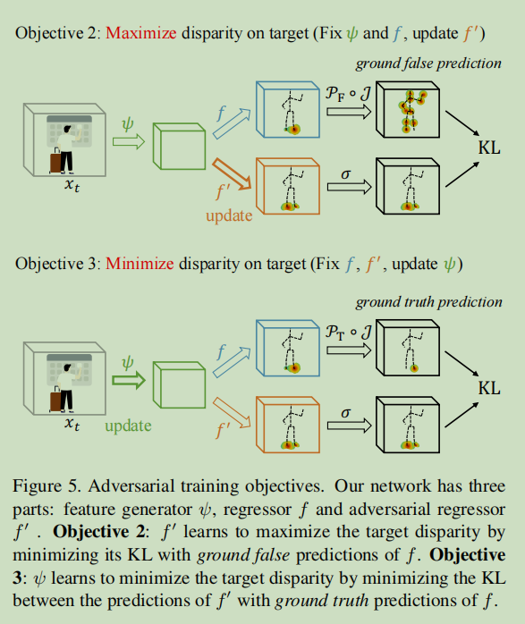

# 人体姿态估计-5月

---

Paper Reading系列目标为论文泛读，了解论文主要思想，理解有误之处请各位大佬指正

## 2D Pose

### 《**Numerical Coordinate Regression with Convolutional Neural Networks**》

详细见另一篇博客...

### 《**HigherHRNet: Scale-Aware Representation Learning for Bottom-Up Human Pose Estimation**》

由于尺度变化，bottom-up方法难以预测小目标人体姿态

解决小目标问题，主要有两个难点：

+ 尺度变化，如何不牺牲大目标的精度
+ 如何生成高质量高分辨率特征

>当输入尺度增大，小目标效果改善，但大目标效果下降

higher-hrnet使用高分辨率金字塔学习尺度感知表示，训练时使用多分辨率监督，测试时使用多分辨率聚合，作者称higher-hrnet对中等目标人体也有较大改善，对crowdpose拥挤目标也比较鲁棒

作者采用Associative embedding方法预测tagmap

作者认为引入高斯核会影响关键点精度的准确性，减小标准差能有所缓解，但会导致难以训练

作者采用在不同分辩率上标准差不变（默认为2）的高斯分布，用以预测更高分辩率的heatmap(1/2)，作者认为1/4分辨率的heatmap不足

> 保持标准差不变：不同分辨率用以预测不同尺度上关键点，高分辨率特征图上，一个相对更小的标准差，用于更精确预测小目标人体

作者并没有对金字塔不同层，指定不同尺度的人体，而是让模型自动分辨不同尺度的目标

+ 本文相对hrnet只有两层特征金字塔，FPN有4层，结构差异
+ 由于高斯核，gt关键点相互耦合，难以解耦

tagmap需要全局推理且在1/2层难以学习收敛，因此只在最低的分辩率1/4上预测

推理阶段：作者通过双线性插值将不同尺度上的heatmap恢复到输入尺寸，然后平均

这种方式，能够综合不同尺度的结果

作者feature map聚合和heatmap聚合实验

### 《**Bottom-Up Human Pose Estimation Via Disentangled Keypoint Regression**》

disentangled keypoint regression (DEKR)

+ 作者提出要准确回归关键点坐标，需要关注关键点附近区域
+ 通过像素级spatial transformer实现adaptive convolutions
+ 多分支结构，每个分支负责一个关键点

采用centernet方式，在每个人体目标预测一个像素中心，然后预测2K个偏置，等价于fc直接回归？

使用adaptive conv关注关键点区域：

### 《RMPE: Regional Multi-person Pose Estimation》

[Code](https://cvsjtu.wordpress.com/rmpe-regional-multi-person-pose-estimation/)

作者针对不精确的人体检测导致的问题，提出RMPE 方法，包括以下三个模块：

+ *Symmetric Spatial Transformer Network (SSTN)*
+ *Parametric Pose NonMaximum-Suppression*
+ *Pose-Guided Proposals* *Generator (PGPG)*

问题1：检测框抖动导致关键点不输出（？训练策略问题）

问题2：冗余框

模型架构:

symmetric spatial transformer network (SSTN)用于提取高质量人体区域

spatial detransformer network (SDTN)用于将pose恢复到原图	

Parallel SPPE用于反传已目标中心化的pose误差，训练时权重将会被冻结；可视为一种正则化手段；测试时丢掉该分支

parametric pose NMS利用pose信息剔除冗余的人体检测框

以姿态距离作为相似性准则

pose-guided human proposal generator (PGPG)用于增强候选样本

作者通过对detect和gt box之间的offset进行建模，通过唯一的预测框模拟多个proposal用于训练

## 领域自适应

### 《**Regressive Domain Adaptation for Unsupervised Keypoint Detection**》

[Github](**https://github.com/thuml/Transfer-Learning-Library/tree/dev)

[CVPR2021 | RegDA：针对无监督关键点检测的回归域自适应方法](https://zhuanlan.zhihu.com/p/356674832)

领域自适应Domain Adaptation旨在将一个已标注得源域知识迁移到一个未标注得目标域

> 参考博客：[《迁移学习》: 领域自适应(Domain Adaptation)的理论分析](https://zhuanlan.zhihu.com/p/50710267)
>
> **领域自适应**：即**Domain Adaptation**是迁移学习中很重要的一部分内容，目的是把分布不同的源域和目标域的数据，映射到一个特征空间中，使其在该空间中的距离尽可能近。于是在特征空间中对source domain训练的目标函数，就可以迁移到target domain上，提高target domain上的准确率。

以往方法主要针对分类问题，回归问题可能失效；分类问题存在明显的任务目标边界，使用领域对齐，扩大类别边界；而回归空间是连续的，没有明确的决策边界；另一方面，由于图像存在多维，尽管像素有限，关键点仍然属于一个巨大的离散空间

作者指出，如果右脚踝点预测错误，该错误点很有可能错误预测到左脚踝位置或者其他关节，而不是任意背景位置，因此作者指出输出空间是一个稀疏空间；如果能将稀疏空间限制到k个关键点的空间，将缩小回归和分类的差距。

作者针对回归问题，提出RegDA用于无监督得关键点检测

+ 作者引入空间概率分布，来描述悉稀疏性，并用于指导对抗回归器的分类
+ 作者提出一个新方式，将求两个回归器（预测回归器、对抗回归器）最大最小值方式，转化为求两个相反目标的最小化

关键点任务相对于分类任务的标注成本更大

有监督的关键点检测：

heatmap在有监督中表现较好，但是在领域自适应中会产生梯度爆炸，这是由于heatmap不是有界的，极大值化会导致所有位置的预测值增大；作者提出空间softmax归一化heatmap	来解决这个问题，

对抗回归器的优化目标是最大化预测值与目标域的差异，最小化与源域的差异（还不是很理解？）

换句话说，目标的对抗回归器期望在源域上正确预测，在目标域上尽可能出错。

当输出空间太大，对抗回归器在目标域表现较差；输入给定时，输出空间概率并不均匀	

由于错误点更容易出现在其他关键点，作者将heatmap求和+归一化，用来近似表示空间概率分布

优化目标

1. 更新整个网络，使得回归器![[公式]](https://www.zhihu.com/equation?tex=f)和对抗回归器![[公式]](https://www.zhihu.com/equation?tex=f%27)在源域上的损失尽可能小。
2. 只更新![[公式]](https://www.zhihu.com/equation?tex=f%27)，使得在目标域上，对抗回归器![[公式]](https://www.zhihu.com/equation?tex=f%27)的预测和回归器![[公式]](https://www.zhihu.com/equation?tex=f)的ground false prediction的KL散度尽可能小（最大化预测差异）。
3. 只更新![[公式]](https://www.zhihu.com/equation?tex=%5Cpsi)，使得在目标域上，对抗回归器![[公式]](https://www.zhihu.com/equation?tex=f%27)和回归器![[公式]](https://www.zhihu.com/equation?tex=f)的ground truth prediction的KL散度尽可能小（最小化预测差异）。

领域自适应细节尚未理解，待续...

## 3D pose

### 《Anatomy-aware 3D Human Pose Estimation with Bone-based Pose Decomposition 》

1. 将3D关键点预测转换为关节长度预测与关节方向预测
2. 提出分层关节方向预测网络
3. 高效关节长度预测网络
4. 利用2D可见度分数改善深度模型性

关节的3D向量 = 方向向量·长度

## Transformer

### 《**Pose Recognition with Cascade Transformers**》

Pose Regression TRansformers

+ 通过级联Transformer实现基于回归的人体姿态识别
+ 作者提出两阶段的级联transformer以及使用spatial transformer的端到端序列化方式
+ 对不同层可视化关键点分布

两阶段类似于top-down方法：DETR+PRTR

端到端方式:

crop操作对于边框坐标可微：wxh是关键点 transformer期望的feature map大小

使用了不同中间层的多尺度特征（使用双线性核），双线性采样细节？（尚未明白）

PRTR的解码过程

......

## PoseTrack

视频多帧人体姿态估计

### 《**Deep Dual Consecutive Network for Human Pose Estimation**》

作者提出DCPose（dual consecutive pose estimation framework）	

作者设计了三个模块

+ PTM：a novel Pose Temporal Merger network，聚合多帧，获取搜索空间
+ PRF：a Pose Residual Fusion network ，获取姿态残差
+ PCN：a Pose Correction Network，通过融合的heatmap和pose残差，生成微调后的heatmap

PTM

