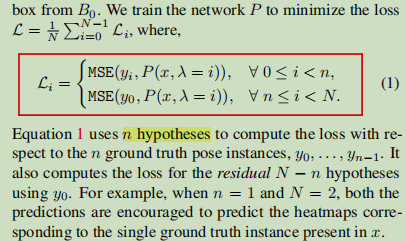

# 人体姿态估计Paper Reading

---

Paper Reading系列目标为论文泛读，了解论文主要思想，理解有误之处请各位大佬指正

.......3月笔记补，后续整理版

本次多篇论文主要关注人体姿态中遮挡、不可见等问题

## 2D人体姿态估计

### 20210219：《Deeply learned compositional models for human pose estimation》

身体部位的分层表示

人体姿态估计存在的难点，当存在重叠、靠近、复杂背景时，关键点的表现仍相对较差。

一种解决思路是利用人体组合性。	

+ 通常，子模块位置被假设为高斯分布，且anchor预设为平均值
+ 由于常用离散变量对部件相容性进行建模，导致high level 部件复杂度指数增加？
+ 当组合结构有循环时，需要使用近似推理算法

两阶段，该方法结合了bottom up和 top down方法：

1. 在bottom up阶段: high level部分由low level递归学习得到
2. 在top down阶段，low level部分，由父级进行优化微调

解决方案：

1. DLCMs-Compositional models组合模型

   + 

   + 
   + 

2. SLIS- Spatially local information summarization

   + 

3. 基于骨架得表示方法-Bone-based part representation

   + 

4. 结构化的网络结构

### 20210219：《Does learning specific features for related parts help human pose estimation》

基于零件的分层网络：作者认为并非所有的关节部件都需要共享模型的深层表示

作者认为不是所有关节都是相关联的，

+ 基于人体关节结构的手工方法
+ 基于数据驱动的方法，将关节位置看作随机变量（更优）

作者使用数据驱动的方法找出不同关节部位之间的相关性

PBN模型：

1. 一个主干，学习一般所有身体部位的共享表示
2. 一些分支，学习特定于每一组相关部位的高级特征

作者认为特定分支能够改善遮挡关节的位置精度

stack-PBN

### 20210220：《**Human Pose Estimation for Real-World Crowded Scenarios**》

真实拥挤场景下的人体姿态估计

作者提出将可见点和遮挡点分开计算loss

需研究[代码](https://github.com/thomasgolda/Human-Pose-Estimation-for-Real-World-Crowded-Scenarios)可见点/遮挡点如何分配，和计算loss???

1. 人工合成遮挡：
   - 被物体遮挡：利用coco分割标注
   - 被人遮挡：1. 只截取部分身体 2. 遮挡人体贴在边界附近
2. OccNet/OccNetCB：
   - 

### 20210224: 《UniPose: Unified Human Pose Estimation in Single Images and Videos》

UniPose基于waterfall Astrous Spatial Pooling结构，结合了上下文分割和关键点定位

WASP-Waterfall Atrous Spatial Pooling，用于学习多尺度特征

WASP受ASPP和Res2Net启发，但WASP并不是输入并行，而是通过滤波器从第一个分支创建出新的分支来。WASP每一个分支拥有不同大小的感受野，并通过“瀑布”方式排列

WASP的设计目标是减少参数的数量，以解决内存约束问题，并克服空洞卷积的限制。

UniPose Decoder

### 20210224：《TRB: A Novel Triplet Representation for Understanding 2D Human Body》

一种新的人提特征表示方式Triplet Representation for Body

试图同时表示人体骨架与人体形状

### 20210224：《Peeking into occluded joints: A novel framework for crowd pose estimation》

作者指出不可见点的预测主要和上下文的的理解，以及人体姿态pose的结构化理解有关	

因此，作者提出OPEC方法，并提出两阶段框架

作者指出：

1. 人体结构提供关节间重要的约束信息，因此作者使用GCN来直接对人体结构关系进行建模
2. 相关的图像上下文是不可见点学习的重要信息
3. 拥挤遮挡场景下，人体的相互关系变得至关重要

能否解决遮挡或关键点错乱？？

1. **OCPose**遮挡数据集
2. OPEC-Net框架

模型结构:

1. Initial Pose Estimation：作者使用AlphaPose++作为姿态估计器
2. 作者通过*integral regression*从heatmap获取坐标表示的init pose
3. Image-Guided Progressive GCN：用于坐标纠正（ResGCN Attention, 细节待阅读）
4. **Cascaded Feature Adaption (CFA)**：利用级联方式融合深层与浅层特征，扩大感受野，用于IGP-GCN输入
5. **CoupleGraph**：将单个人图扩展到一个捕获更多人类交互的耦图，这是通过连接相应的关节来捕获人类交互信息来实现的

### 20210304：《Multi-Hypothesis Pose Networks: Rethinking Top-Down Pose Estimation》

Top-Down方法假设在每个检测框都有唯一人体，但在拥挤场景下，top down方法容易失效；

如下图，多人遮挡情况下，前后人体框指向不明，人体关键点容易混淆

作者提出MHPNet来解决这个问题；

简而言之，作者通过one-hot 向量 lamada来控制模型注意到不同目标

关于loss的计算：

+ N表示预测的候选目标数量
+ B0表示input对应的gt box，剩下的n-1个框表示与B0重叠的人体框
+ loss不仅计算n个候选重叠目标（与gt对应），还会计算剩下N-n个目标相对y0的loss，据作者所说，这样更稳定和鲁棒

不同lamada值对应不同的人体目标

代码实现：

## 3D人体姿态估计

### 20210329：《**3D human pose estimation in video with temporal convolutions and semi-supervised training** 》

[github工程代码](https://github.com/facebookresearch/VideoPose3D)

+ 呈现了一种基于2D关节点轨迹的空洞时域卷积方法，简单、有效的预测出视频中的3D人体姿态。此模型在相同精确度水平下比基于RNN的模型更加高效，不论是在计算复杂度方面还是模型参数方面
+ 提出基于半监督方法利用未标注的视频

基于2D关键点的空洞时域卷积

半监督训练方法:

+ 对于已标注的3D pose，使用3D的gt pose作为目标
+ 对于未标注的数据，会通过得到的3D pose反向投影回2D pose，并与预测的2D pose input进行比较
+ 2Dpose的精度取决于 root joint的精度，以及相对于root joint的3D pose精度

当目标远离摄像头时，获取精确的轨迹较为困难，因此作者提出下述loss，根据相机空间,gt目标深度Yz来进行加权，距离越远权重越小

WMPJPE：loss

