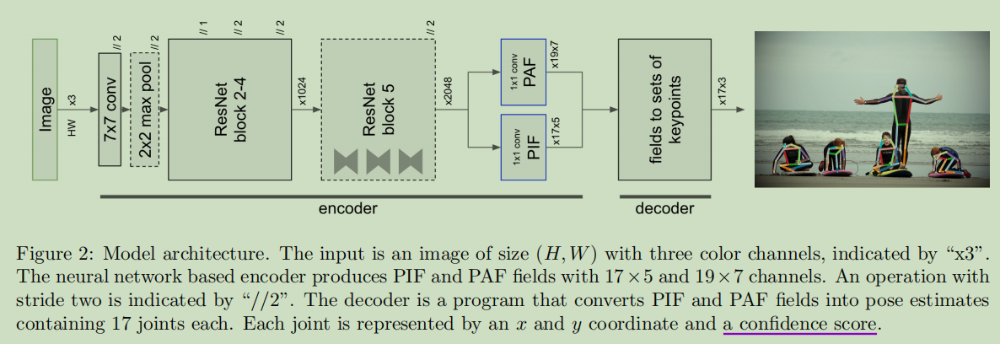
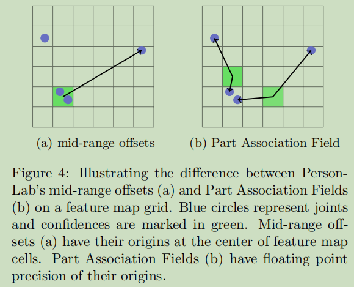
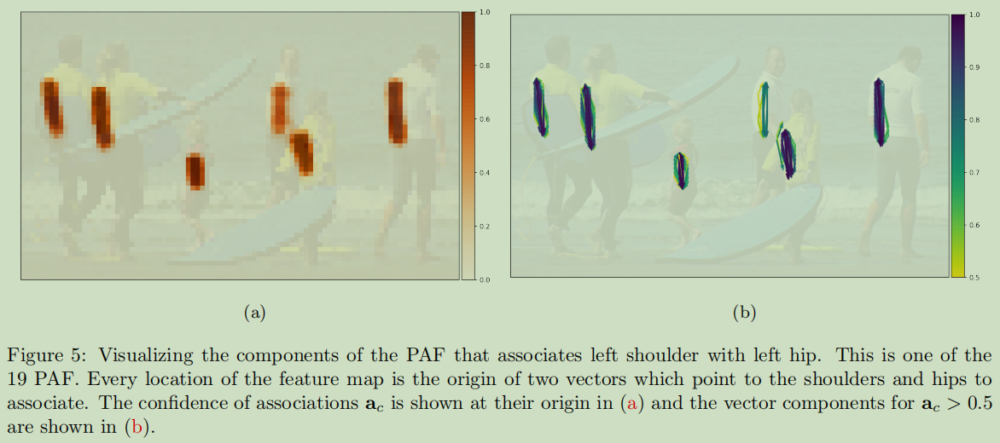

# 人体姿态估计BottomUp

---

### 20210221：《Associative Embedding:End-to-End Learning for Joint Detection and Grouping》

1. 什么是associative embedding？
2. 怎么计算？
3. 有什么作用？

### 20210221：《PifPaf: Composite Fields for Human Pose Estimation》

*Part Intensity Field (PIF)* +*Part Association Field (PAF)*

作者提出方法，在低分辩率、拥挤、杂乱、遮挡等场景中，都超越了之前方法：

作者认为主要得益于：

1. PAF关联场编码了细粒度信息
2. 对于包含不确定性的回归问题，使用了Laplace loss

模型架构：

Part Intensity Field （PIF)：由于预测置信分，精确位置，关节大小

PIF是一个复合场，由标量场何矢量场，叠加复合而成；如下图

作者利用高斯核提升定位精度，sigma可学习，用于适应不同尺寸大小的关节

Part Association Field (PAF)：用于预测关节部件之间的关系，将预测的关节点关联成人体姿态

