# Head Pose Estimation

---

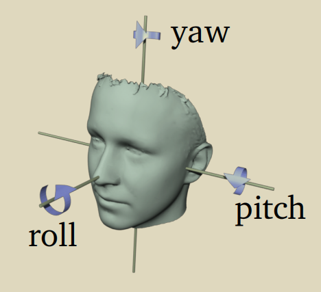

## 20210528：《**Fine-Grained Head Pose Estimation Without Keypoints**》

bin 分类+姿态角回归

人头姿态的应用 包括：视线估计、注意力建模、视频3D模型拟合、人脸对齐等

传统头部姿态估计方法：

1. 预测2d关键点
2. 将关键点与3d头部模型建立关联
3. 与标准模型进行对齐

尽管由于深度学习模型带来关键点精度的提升，头部姿态仍然可能存在误差：

+ 关键点检测错误，可能导致姿态预测错误
+ 头部姿态精度取决于3D head 模型精度?

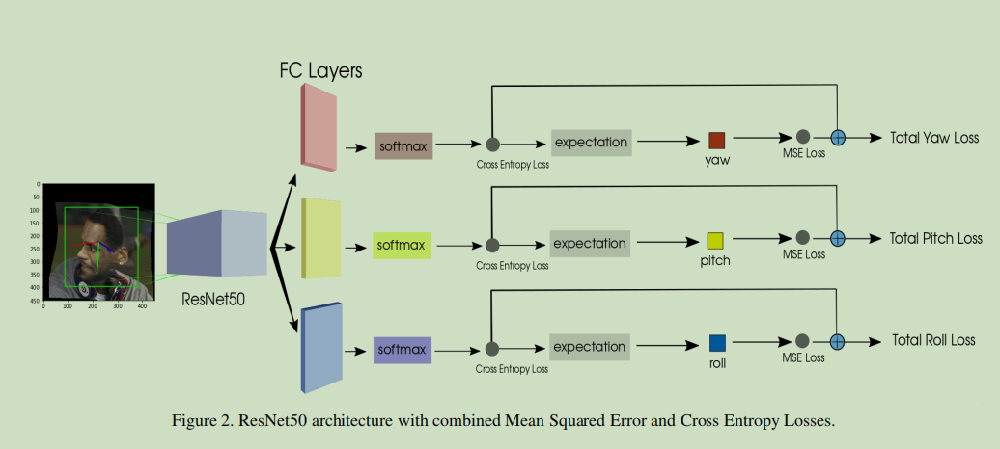

将角度范围分为66bins，针对66个类别进行softmax，并对结果求expectation期望

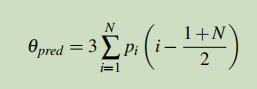

## 20210528：《**img2pose: Face Alignment and Detection via 6DoF, Face Pose Estimation**》

代码：[github](http://github. com/vitoralbiero/img2pose)

+ 6DoF关键点姿态预测
+ 直接从全景图学习pose，抛弃预处理方式的detection，不需要提前人脸crop
+ 3D pose的学习依然可以转化为2D box输出

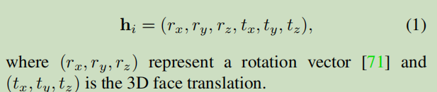

作者提出以下结论：

1. 6DoF pose相比关键点更容易预测（关键点除了需要学习刚性变换，还要学习非刚性人脸形变，以及局部特殊人脸形状）
2. 6DoF得标注，不仅仅包含bbox的信息（3D位置+3D方向）

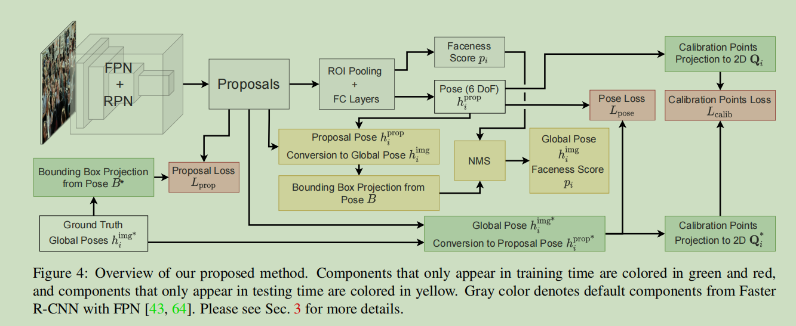

细节未完待续...

## 20210528：《**HYBRID COARSE-FINE CLASSIFICATION FOR HEAD POSE ESTIMATION**》

代码：[github](https://github.com/haofanwang/accurate-head-pose)

通过附加的稀疏单元分类，协助精度更高的稠密分类器

3D理解的大部分方法需要获取2D关键点。3D头部姿态估计可视为3D理解的一部分。

基于关键点的两阶段3D头部姿态估计可能存在误差。

1. 复杂场景下难样本，关键点精度较差
2. 3D头部模型的点对点拟合可能带来误差（尚不明了？）

作者指出论文《**Fine-Grained Head Pose Estimation Without Keypoints**》中使用bin classification过于稀疏，可能带来量化误差

据作者发现，分类模型比回归模型收敛更快，这回降低多损失训练方案的有效性。但是直接细化的分类可能减少类似问题。因此作者提出了，稀疏到稠密的分类框架

本文主要贡献：

1. 使用更稠密的bin分类，减少稀疏分类带来的误差
2. 提出混合稀疏-稠密分类方案

模型结构:

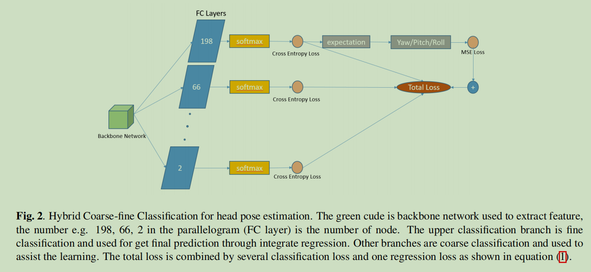

损失函数：

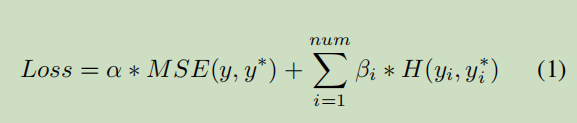

积分回归**Integrate regression**，将多分类中求最大值操作，改为计算多类别每一个输出概率的期望

类别概率x类别索引，类似soft argmax

直观地说，这种方案可以看作是一种减少问题的方法，因为bin分类是一个粗糙的注释，而不是精确的标签，分类和输出通过多损失学习来连接，这使得分类也对输出很敏感。另一种解释是，bin分类使用了非常稳定的softmax层和交叉熵损失，因此网络学习了以鲁棒的方式预测姿态的邻域。(暂时没太理解)

alpha、beta变量实验

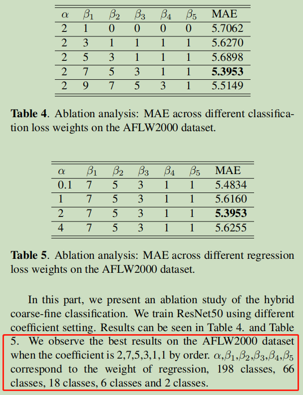

## 20210607：《**Multi-task head pose estimation in-the-wild**》

结合关键点、可见度、头部姿态的多任务模型

1. 训练基于关键点的人脸对齐模型
2. 针对pose ,  关键点align，可见度，进行finetune
3. 将关键点align以及可见度作为回归树输入，进一步提升精度

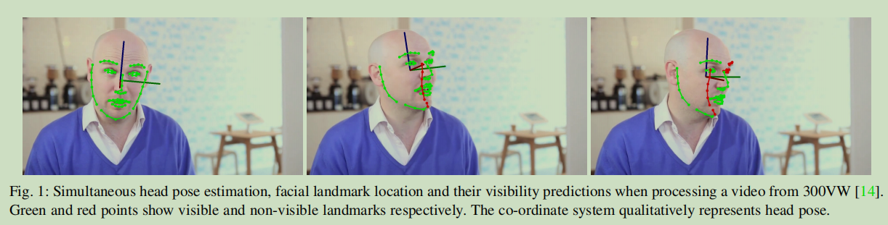

pose 以及刚性变换，共6个3D参数，采用encode最后一层输出，可见度和非刚性关键点采用decoder最后一层输出

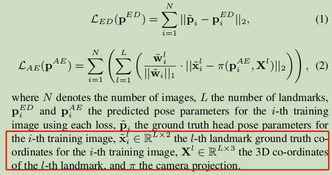

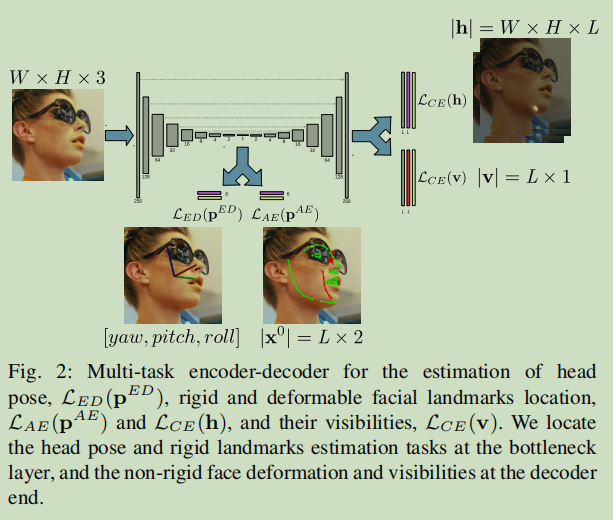

**Occlusion-aware Regressor (OR)**

使用回归树

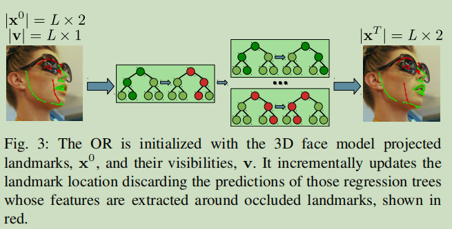

## 202106009: 《FSA-Net: Learning Fine-Grained Structure Aggregation for Head Pose Estimation from a Single Image 》

头部姿态的实质是一个三维向量，该向量包含了yaw、pitch、roll 三个角度

模型架构：

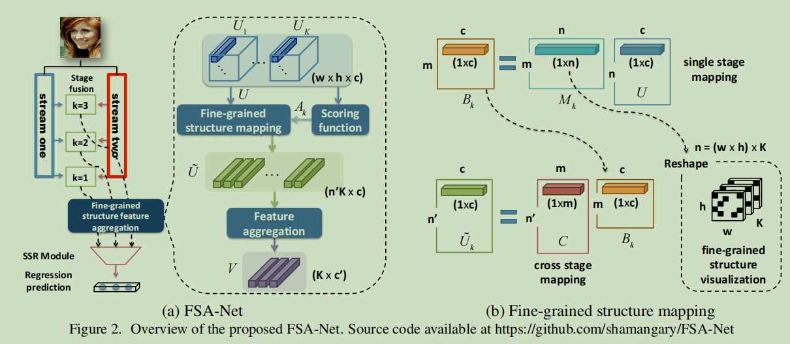

FSANet:

1. 模型输入经过两个stream, 总共K个stage（K=3）
2. 每个stream在每个stage得到一个feature map，对于第k个stage，两个stream的feature 通过stage fusion module融合（点乘），如图绿色框；
3. 然后通过1x1 conv，转换为c个channel；通过average pooling将feature size转换为wxh，从而得到Uk(wxhxc)，Uk每一个位置的c维向量代表一个空间位置

聚合aggregation操作：

+ 传统聚合方法：capsule 、 NetVLAD等bag of feature方法，忽略了空间信息；作者提出空间分组方法（聚合之前的操作）
+ 作者通过score function获取Ak, 然后通过 fine-grained structure mapping module得到Vk（细节...）

关于score function， 作者研究了3种配置

1. 1x1 conv + sigmoid， 可学习方式，可能导致过拟合
2. 使用方差，不可学习
3. 不做任何处理，常数变换

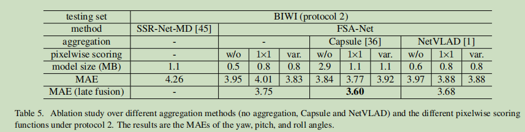

FSA-Net基于soft stagewise regression scheme，参考软阶段回归网络SSR-Net，SSR本来用于年龄估计问题（其实上述方法都参考了类似bins分类方法）

> 参考博客: [SSR-Net: A Compact Soft Stagewise Regression Network for Age Estimation](https://blog.csdn.net/weixin_46297585/article/details/105581632)

两个关键点思想是阶段回归和动态范围

阶段回归：将连续回归问题转化成离散的sk个bins分类问题

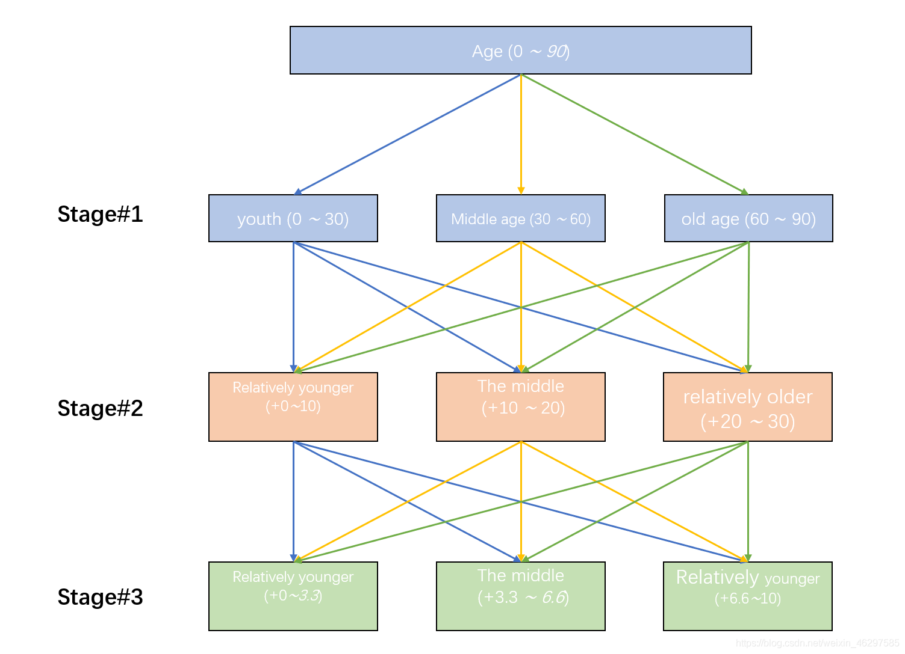

动态范围：bins数量可动态调整

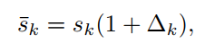

AFLW2000上测试结果

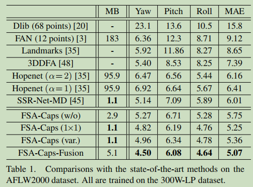

## 20210609：《**WHENet: Real-time Fine-Grained Estimation** **for Wide Range Head Pose** 》

[GITHUB](https://github.com/Ascend-Research/HeadPoseEstimation-WHENet)

之前算法更多集中正面角度，侧面角度相对较差

作者针对该问题，提出WHENet-Wide Headpose Estimation Network 

+ 作者提出a *wrapped loss*，提高yaw角度的精度
+ CMU Panoptic Dataset自动标注方法
+ 增大yaw 至全范围 -99~+99 -> -180~+180
+ 简单的改进，提升hopenet29%
+ 使用EffificientNet-B0作为backbone，提高inference速度

模型架构：

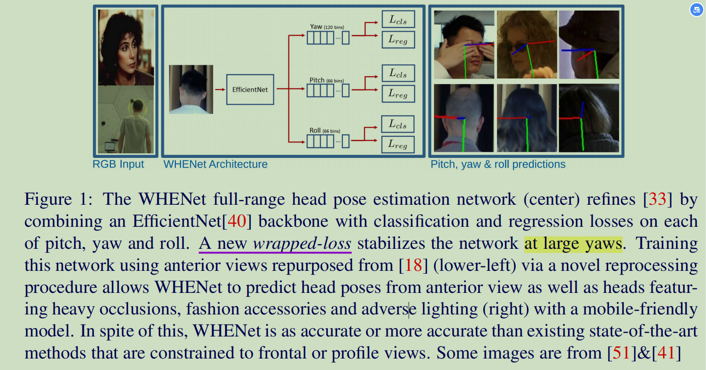

作者指出，超出150度范围时，MSE loss会导致结果飘逸，因此提出warpper loss

作者不是直接惩罚角度值，而是最小化需要将人脸对齐旋正的最小角度值

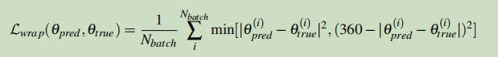

Loss: 下图loss 是gt=150度时曲线图

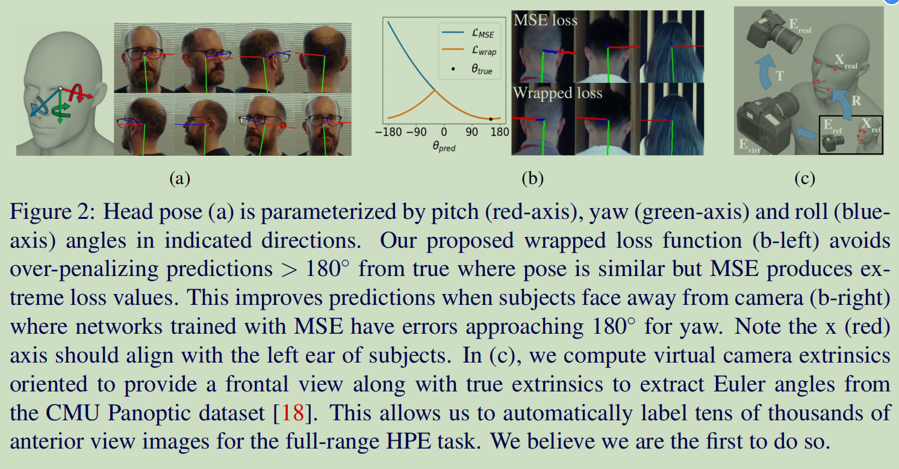

效果对比：

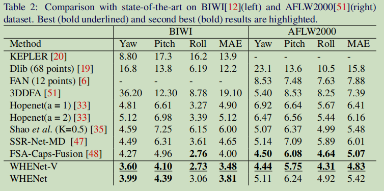

## 持续更新中...

