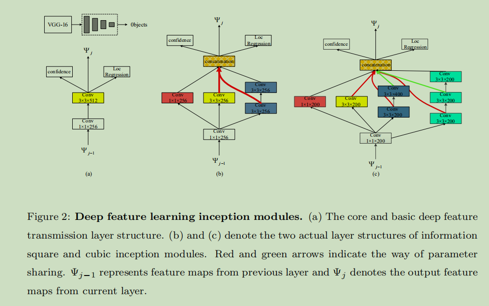
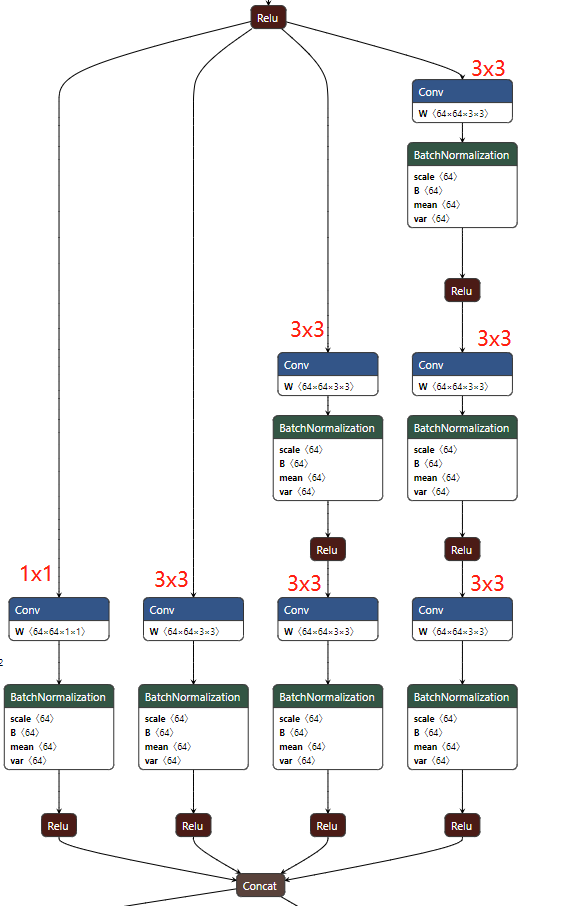
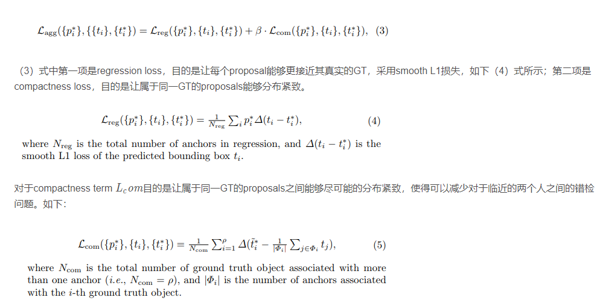
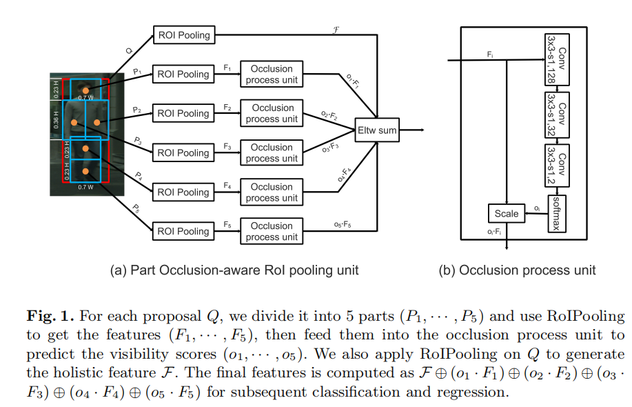
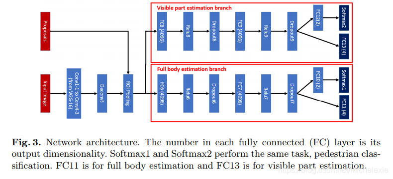
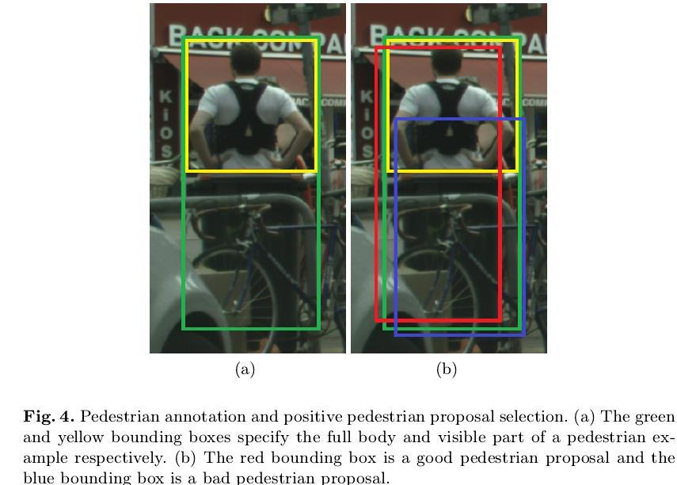

# 目标检测PaperReading

---

## AnchorFree

### 20210316：CenterNet2-《Probabilistic two-stage detection》

## 多尺度特征

### 20210308：《MDFN: Multi-Scale Deep Feature Learning Network for Object Detection》

MDFN：combining multi-box, multi-scale and multi-level techniques

onnx模型示意图：

## 针对遮挡密集场景的目标检测

### 20210303：《Repulsion Loss: Detecting Pedestrians in a Crowd》

例如下面示意的这个情况，两个黑色的框代表的是两个Ground Truth，红色和绿色分别是被assign到1号的GT上的anchor或者proposal。

Repulsion Loss:

### 20210303：《Occlusion-aware R-CNN: Detecting Pedestrians in a Crowd》

先前的目标检测都没有考虑predict_box之间的联系，只考虑了预测的box要尽可能的接近gtbox ,使得目标检测对于nms后处理很敏感

repulsion loss 使得proposal尽可能的靠近它的gt 远离其他的gt box 和其他的proposal

1. Aggregation Loss（loss角度改善遮挡的问题）：

2. Part Occlusion-aware RoI Pooling Unit（ROI Pooling操作改善遮挡的问题）

作者分别对着5个局部区域分别进行了预测一个0到1的遮挡的score，用来表示着5个区域是否被遮挡，可以把这个部分认为是一个简单的mask信号，最后作者使用这5个score和其对应区域的feature相乘后相加，得到最终的RoI feature。

### 20210303：《Bi-box Regression for Pedestrian Detection and Occlusion Estimation》

1. 一个CNN包含两个分支：全身和可见部位估计
2. 一种新的训练策略，对两个分支的分数有效融合，改进行人检测的表现

3. 提出一种新的选择positive pedestrian proposal准则，有效提升遮挡行人检测

