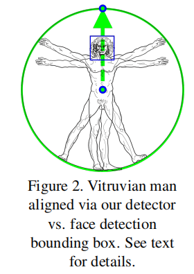
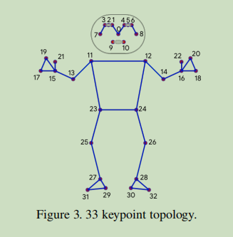
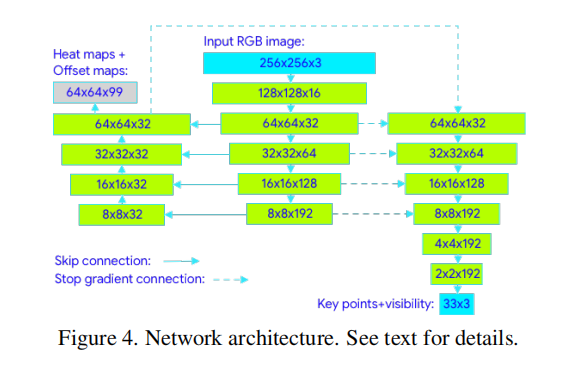

# BlazePose

---

> 论文: 《**BlazePose: On-device Real-time Body Pose tracking**》

## 人体对齐

## FC+hmp+offset

关于blaze pose, 为啥

heatmap分支只是用来辅助loss计算，inference阶段不使用

训练阶段，regression分支，梯度不会反传给heatmap分支？