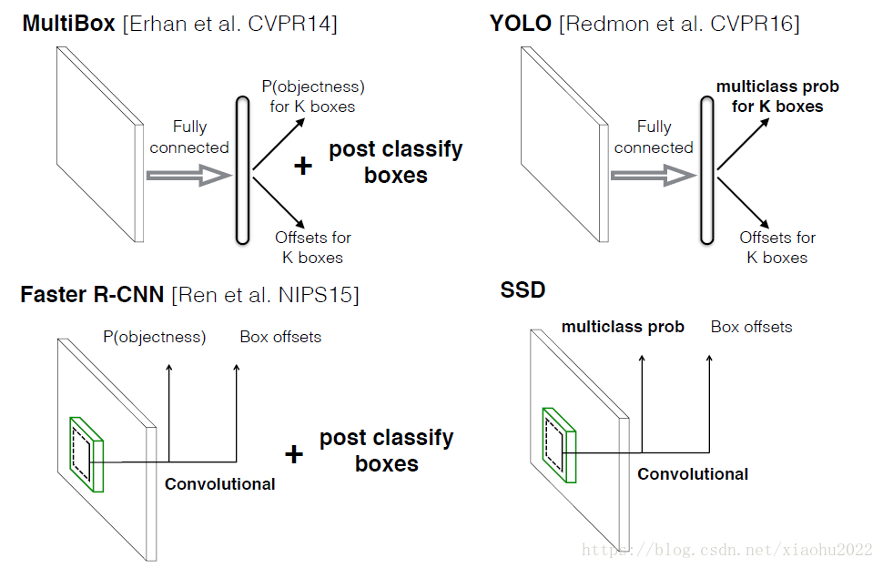
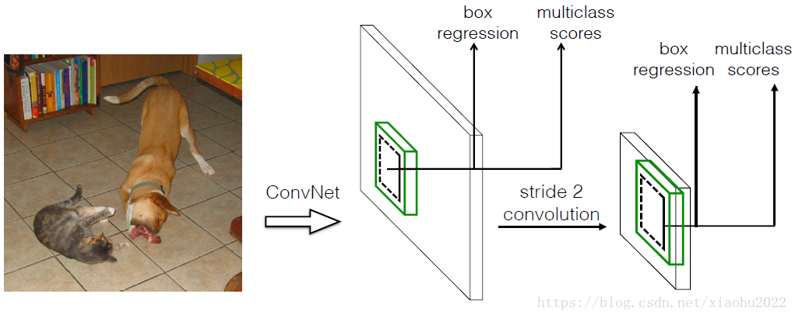
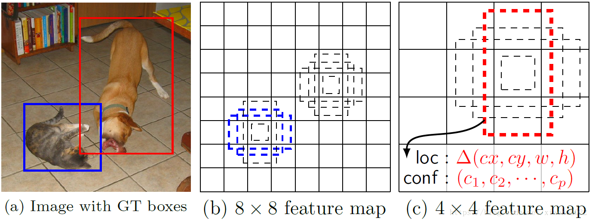
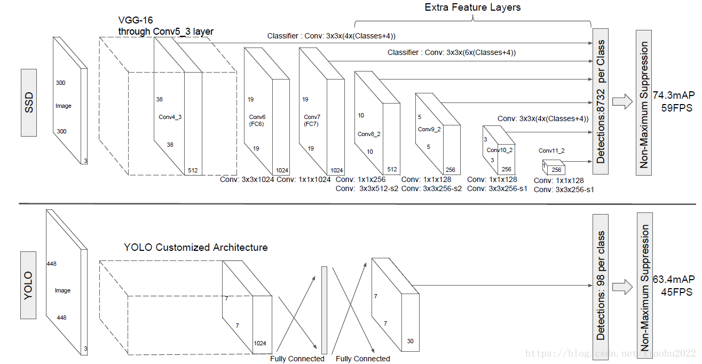
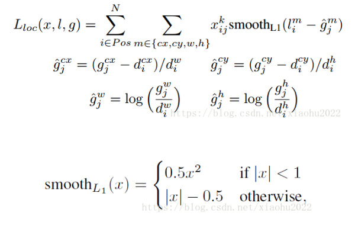
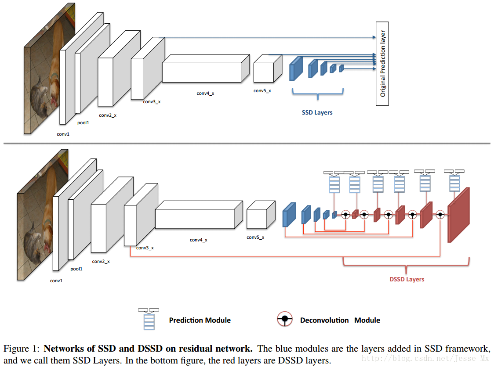
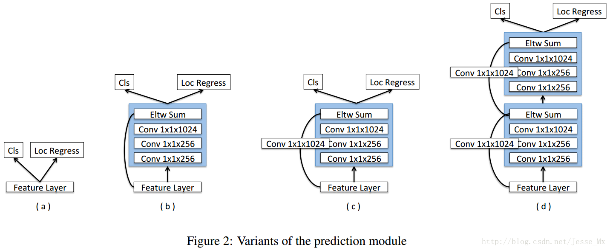
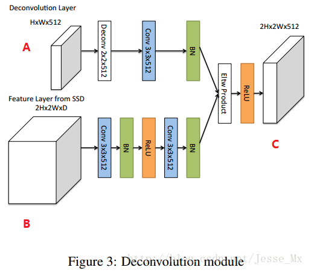
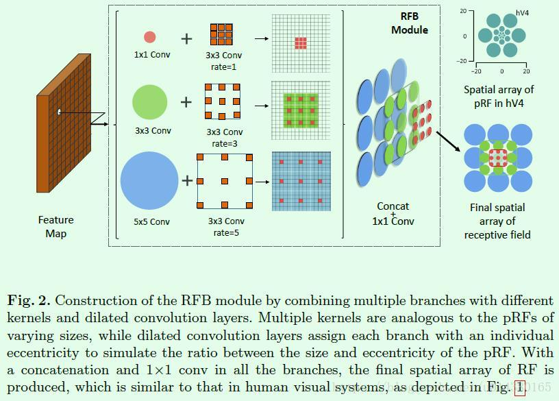
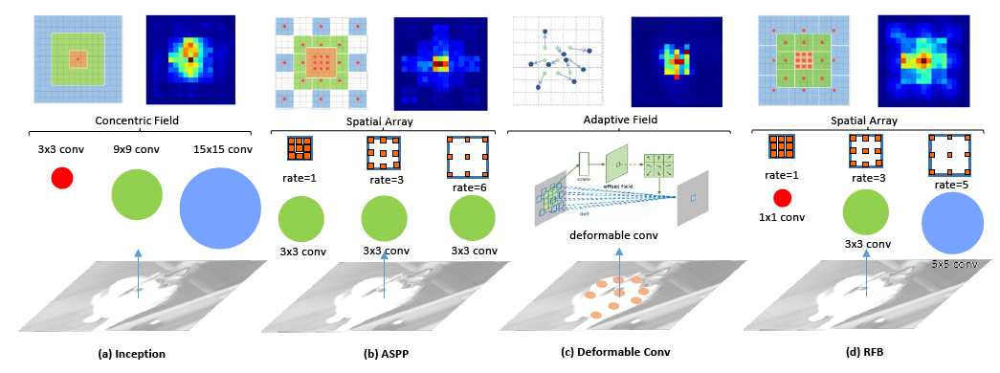

# 目标检测SSD系列模型总结

---

## SSD 

> [目标检测算法之SSD](<https://blog.csdn.net/xiaohu2022/article/details/79833786>)

### 算法思路

SSD与其他目标检测算法思路的对比

SSD的基本思路

每个单元使用了4个不同的先验框

### 坐标回归：encode与decode

SSD预测的是中心坐标的偏置和长宽比例的对数，该过程叫编码encode

反向过程为解码decode

SSD caffe源码中针对上述过程，加入了trick:  加入variance超参数

### SSD模型基本结构

### 先验框

每个特征图一共有66个先验框{1,2,3,12,13,1′}{1,2,3,12,13,1′}，但是在实现时，Conv4_3，Conv10_2和Conv11_2层仅使用4个先验框，它们不使用长宽比为3,133,13的先验框。每个单元的先验框的中心点分布在各个单元的中心

SSD300一共可以预测38×38×4+19×19×6+10×10×6+5×5×6+3×3×4+1×1×4=873238×38×4+19×19×6+10×10×6+5×5×6+3×3×4+1×1×4=8732

个边界框，这是一个相当庞大的数字，所以说SSD本质上是密集采样。

先验框与ground truth的匹配原则：

> 在Yolo中，ground truth的中心落在哪个单元格，该单元格中与其IOU最大的边界框负责预测它。

1. SSD的先验框与ground truth的匹配原则主要有两点。首先，对于图片中每个ground truth，找到与其IOU最大(不一定大于0.5)的先验框，该先验框与其匹配，这样，可以保证每个ground truth一定与某个先验框匹配。通常称与ground truth匹配的先验框为正样本，反之，若一个先验框没有与任何ground truth进行匹配，那么该先验框只能与背景匹配，就是负样本。
2. 一个图片中ground truth是非常少的， 而先验框却很多，如果仅按第一个原则匹配，很多先验框会是负样本，正负样本极其不平衡，所以需要第二个原则。第二个原则是：对于剩余的未匹配先验框，若某个ground truth的IOU大于某个阈值（一般是0.5），那么该先验框也与这个ground truth进行匹配。这意味着某个ground truth可能与多个先验框匹配，这是可以的。但是反过来却不可以，因为一个先验框只能匹配一个ground truth，如果多个ground truth与某个先验框IOU大于阈值，那么先验框只与IOU最大的那个先验框进行匹配。

负样本相对正样本会很多。为了保证正负样本尽量平衡，SSD采用了hard negative mining，就是对负样本进行抽样，抽样时按照置信度误差（预测背景的置信度越小，误差越大）进行降序排列，选取误差的较大的top-k作为训练的负样本，以保证正负样本比例接近1:3

### 损失函数

## DSSD

### 模型结构

DSSD相比SSD的一个最大的提升在于对小目标的检测度上DSSD有了很大的提升，文章的最后部分也展示了小目标的检测效果。

### PM模块与DM模块

PM预测模块

图（c）是文中用于分类和回归的最优结构。

图（b）、图（c）、图（d）均是在SSD的基础上将原有的结构改成Resnet模块

这么做的目的是提取更深维度的特征用于分类和回归。

DM反卷积模块

## RefineDet

## RFBNet

>[RFB Net算法笔记](<https://blog.csdn.net/u014380165/article/details/81556769>)

### 思路

借鉴inception思想，引入dilated convlution，主要增加感受野，和可变形卷积有类似作用

### RFB结构

参考Inception模块，引入dilated convolution

RFB和RFBs

一方面用3*3卷积层代替5*5卷积层，另一方面用1*3和3*1卷积层代替3*3卷积层，主要目的应该是为了减少计算量，类似Inception后期版本对Inception结构的改进

### 整体结构

RFB Net512-E主要做了2点改变：

1. 对conv7_fc的输出特征做了上up-sample，然后和conv4_3的输出特征做融合，基于融合后的特征做预测。这种做法其实是借鉴了FPN算法的思想。
2. 在RFB结构中增加了7*7大小的卷积分支。