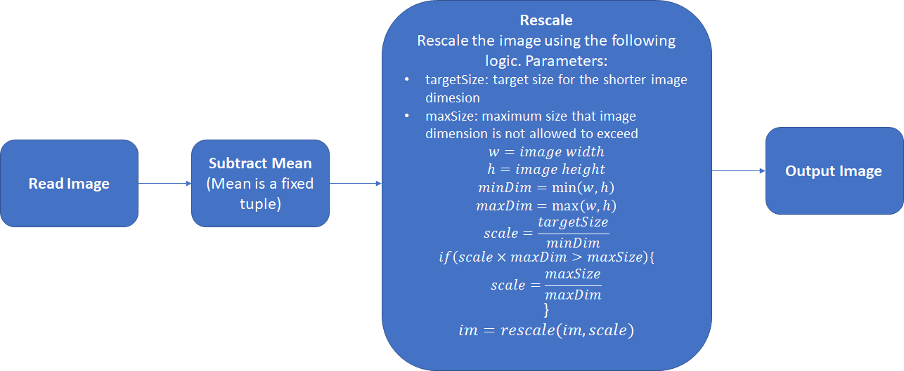
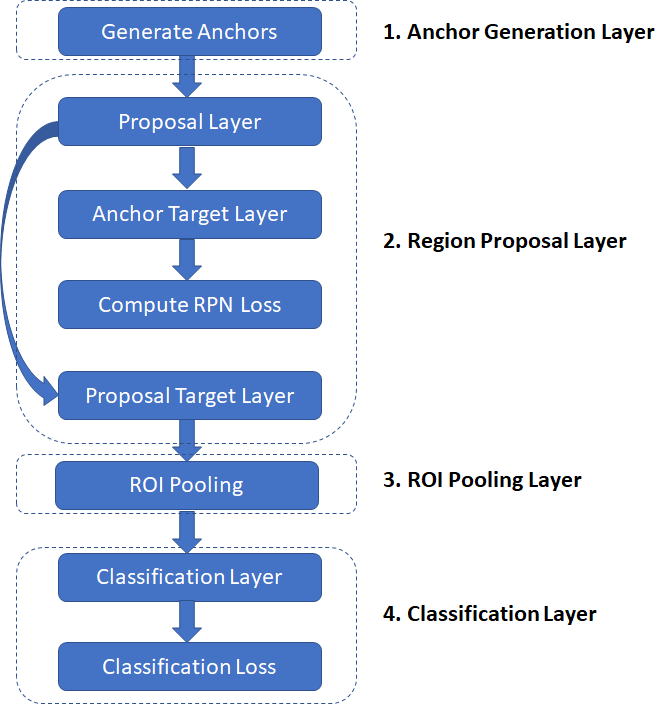

# Faster RCNN

---

> [caffe官方源码](<https://github.com/rbgirshick/py-faster-rcnn#beyond-the-demo-installation-for-training-and-testing-models>)
>
> [Faster RCNN Pytorch 实现源码](<https://github.com/jwyang/faster-rcnn.pytorch>)
>
> [Object Detection and Classification using R-CNNs](<https://github.com/jwyang/faster-rcnn.pytorch/tree/pytorch-1.0>)
>
> [一文读懂Faster RCNN](<https://zhuanlan.zhihu.com/p/31426458>)
>
> [Faster R-CNN解析](<https://www.jianshu.com/p/886b9e861125>)
>
> [从编程实现角度学习Faster R-CNN（附极简实现）](<https://zhuanlan.zhihu.com/p/32404424>)
>
> [数万字长文(Resnet)Faster-R-CNN复现](<https://zhuanlan.zhihu.com/p/75004045>)
>
> [【技术综述】万字长文详解Faster RCNN源代码（一）](<https://zhuanlan.zhihu.com/p/51012194>)
>
> [Object Detection and Classification using R-CNNs](<http://www.telesens.co/2018/03/11/object-detection-and-classification-using-r-cnns/>)
>
> 
>
> 论文：《Faster R-CNN: Towards Real-Time Object Detection with Region Proposal Networks》

---

## Faster RCNN基本流程

### 图像预处理



设置了短边目标长度以及长边的最大长度

### 网络结构

R-CNNs通常由三种类型的网络组成：

+ Head
+ RPN
+ 分类网络

ResNet初始化：

```python
n = m.kernel_size[0] * m.kernel_size[1] * m.out_channels
m.weight.data.normal_(0, math.sqrt(2. / n))
```


### 训练细节



#### Anchor Generation Layer


#### Region Proposal Network


#### Proposal Layer


#### Anchor Target Layer

+ 区分前背景
+ 为前景框生成好的边框回归系数

#### 计算RPN Loss

$RPN Loss = \text{Classification Loss} + \text{Bounding Box Regression Loss}$


...待续


## Faster RCNN 细节


1. [bbox回归中class-agnostic和class-specific的区别在哪？](<https://www.zhihu.com/question/287119448/answer/454968976>)

`class-specific`: 又称class_aware, 利用每一个RoI特征回归出所有类型的bbox坐标，最后根据classification 结果索引到对应类别的box输出；

`class-agnostic` 方式只回归2类bounding box，即前景和背景，结合每个box在classification 网络中对应着所有类别的得分，以及检测阈值条件，就可以得到图片中所有类别的检测结果


2. faster rcnn中anchor的平移不变性如何理解？
3. 一个ground-truth box可能对应多个positive label?

`positive` : 

   + 与某一个ground-truth box的IOU最大；
   + 或与任意ground-truth的IOU超过0.7

`negtive`：

   + 与所有Ground-Truth包围盒的IoU比率都低于0.3的anchor

4. 损失函数中得balanced weight有什么作用
5. 边框回归方法？四个参数

边框回归学习的是一个变换，该变换可以将预测的候选框映射到gt_box, 所需要学习的是$t_x, t_y, t_w, t_h$四个参数


RCNN回归目标，使候选框pool5特征变换后的结果 $d_*$ 与 $t_*​$ 因子尽可能逼近, 目标函数为最小二乘岭回归；


Faster RCNN：

+ 使用RPN代替所有proposal的poo5特征；目标函数不同，

+ faster-RCNN不是class-specific，而是9个回归器，对应9个anchor; 

+ 边框损失函数使用smooth l1 loss


6. 负样本占多数，计算所有anchor的损失函数会偏向负样本？

论文中采用得策略：随机的在一个图像中采样256个anchor，计算mini-batch的损失函数，其中采样的**正负anchor的比例是1:1**（如果正样本数少于128，则拿负样本填充）

7. 初始化权重的问题？

+ 新层，即最后一个卷积层之后的层：从零均值标准差为0.01的高斯分布中获取的权重来随机初始化
+ 所有共享的卷积层：Imagenet预训练权重

8. 梯度裁剪的实现
9. 如何将RPN得到的ROI与Ground truth对应

见ROI网络剖析

10. ROI pooling与ROI Align

ROI Pooling：

RoI Pooling的过程就是将一个个大小不同的box矩形框，都映射成大小固定（w * h）的矩形框；

将输入的h * w大小的feature map分割成H * W大小的子窗口（每个子窗口的大小约为h/H，w/W，其中H、W为超参数，如设定为7 x 7），对每个子窗口进行max-pooling操作，得到固定输出大小的feature map。而后进行后续的全连接层操作。

ROI pooling layer的反向传播：


进行了两次量化：（偏差较大）

+ 第一次：从原图映射到feature map
+ 第二次：大区域划分为小区域


“不匹配问题（misalignment）

ROI Align：（Mask RCNN中提出的）


- 遍历每一个候选区域，保持浮点数边界不做量化。
- 将候选区域分割成k x k个单元，每个单元的边界也不做量化。
- 在每个单元中计算固定四个坐标位置，用双线性内插的方法计算出这四个位置的值，然后进行最大池化操作。


双线性插值本质上就是在两个方向上做线性插值。


如下图所示，虚线部分表示feature map，实线表示ROI，这里将ROI切分成2x2的单元格。如果采样点数是4，那我们首先将每个单元格子均分成四个小方格（如红色线所示），每个小方格中心就是采样点。这些采样点的坐标通常是浮点数，所以需要对采样点像素进行双线性插值（如四个箭头所示），就可以得到该像素点的值了。然后对每个单元格内的四个采样点进行maxpooling，就可以得到最终的ROIAlign的结果


对于检测图片中大目标物体时，两种方案的差别不大，而如果是图片中有较多小目标物体需要检测，则优先选择RoiAlign，更精准些....


---

## 源码解读

### 项目一：faster-rcnn.pytorch

#### 细节解读

1. cfg.TRAIN.PROPOSAL_METHOD

什么是proposal method， ‘gt‘是什么意思’

2. adjust_learning_rate?
3. 为何有偏置的时候学习率翻倍？

[解答1](<https://datascience.stackexchange.com/questions/23549/why-is-the-learning-rate-for-the-bias-usually-twice-as-large-as-the-the-lr-for-t>)

4. 相对于SGD，若使用Adam，学习率需要缩小10倍？
5. 损失函数的计算

```python
loss = rpn_loss_cls.mean() + rpn_loss_box.mean() \
           + RCNN_loss_cls.mean() + RCNN_loss_bbox.mean()
```

6. 权重初始化：截尾正态分布或随机正态分布？边框预测层初始化权重的标准差为啥比其他小
7. 

#### RPN代码实现

1. anchor到底是咋样的？比例枚举与尺度枚举？？

9个anchor对应于3种**scales**（**面积**分别为1282，2562，5122）和3种**aspect ratios**(**宽高比**分别为1:1, 1:2,  2:1)。这9个anchor形状应为：

90.50967 *181.01933    = 1282
181.01933 * 362.03867 = 2562
362.03867 * 724.07733 = 5122
128.0 * 128.0 = 1282
256.0 * 256.0 = 2562
512.0 * 512.0 = 5122
181.01933 * 90.50967   = 1282
362.03867 * 181.01933 = 2562
724.07733 * 362.03867 = 5122

2. 边界的anchor是如何定义的？？

 

3. 绘制RPN网络结构图
4. 为何使用1*1卷积而不使用全连接层
5. 如何由base_anchor， 得到整张图像的anchor
6. RPN的预测是什么？

RPN 的目标就是对原图中的每个锚点对应的 9 个框，预测他是否是一个存在目标的框（并不一定包含完整的目标，只要这个框与 groud truth 的 IoU>0.7就认为这个框是一个 region proposal）。并且对于预测为 region proposal 的框， RPN 还会预测一种长宽缩放和位置平移的位置修正，使得对这个 anchor box 修正后与 groud truth 的位置尽可能重叠度越高，修正后的框作为真正的 region proposal

7. anchor修正值如何修正？

```python
pred_ctr_x = dx * widths.unsqueeze(2) + ctr_x.unsqueeze(2)
pred_ctr_y = dy * heights.unsqueeze(2) + ctr_y.unsqueeze(2)
pred_w = torch.exp(dw) * widths.unsqueeze(2)
pred_h = torch.exp(dh) * heights.unsqueeze(2)
```

8. NMS

   NMS非极大值抑制有两次：

第一次是前景类别概率初步排序，第二次是交并比排序

NMS极大值抑制流程：

+ 前景类别概率排序，保留TopN
+ NMS首先保留得分最高的框
+ 计算该框与其他所有框的IOU

9. loss的计算

smooth l1 loss:

```python
def _smooth_l1_loss(bbox_pred, bbox_targets, bbox_inside_weights, bbox_outside_weights, sigma=1.0, dim=[1]):

    sigma_2 = sigma ** 2
    box_diff = bbox_pred - bbox_targets
    in_box_diff = bbox_inside_weights * box_diff
    abs_in_box_diff = torch.abs(in_box_diff)
    smoothL1_sign = (abs_in_box_diff < 1. / sigma_2).detach().float()
    in_loss_box = torch.pow(in_box_diff, 2) * (sigma_2 / 2.) * smoothL1_sign \
                  + (abs_in_box_diff - (0.5 / sigma_2)) * (1. - smoothL1_sign)
    out_loss_box = bbox_outside_weights * in_loss_box
    loss_box = out_loss_box
    for i in sorted(dim, reverse=True):
      loss_box = loss_box.sum(i)
    loss_box = loss_box.mean()
    return loss_box
```

10. proposal target layer是什么东西？

11. 如何通过偏移产生图像每个点对应的anchor?利用shift

```python
shift_y = xp.arange(0, height * feat_stride, feat_stride)           # 纵向偏移量（0，16，32，...）  
shift_x = xp.arange(0, width * feat_stride, feat_stride)            # 横向偏移量（0，16，32，...）
shift_x, shift_y = xp.meshgrid(shift_x, shift_y)                             
shift = xp.stack((shift_y.ravel(), shift_x.ravel(),
                      shift_y.ravel(), shift_x.ravel()), axis=1)
```


---

### 项目二：simple-faster-rcnn-pytorch

[解读](https://mp.weixin.qq.com/s/S_Bo0WtgkuePwbQHK2gUIw)

 simple-faster-rcnn-pytorch源码解读

[Faster_RCNN 1.准备工作](<https://www.cnblogs.com/king-lps/p/8975950.html>)

[Faster_RCNN 2.模型准备(上)](<https://www.cnblogs.com/king-lps/p/8981222.html>)

[Faster_RCNN 3.模型准备(下)](https://www.cnblogs.com/king-lps/p/8992311.html)

[Faster_RCNN 4.训练模型](https://www.cnblogs.com/king-lps/p/8995412.html)


#### RPN 网络剖析

RPN：


ROI head: 其实就是 fast RCNN


RPN综述：

+ RPN网络是全卷积网络

+ 整个训练过程中batch_size = 1
+ 经过第一个3*3的卷积后，尺寸并未发生变化，作用是转换语义空间


AnchorTargetCreator分析：

RPN非极大值抑制，筛选RPN的正负样本，用于RPN的训练

如何为20000个anchor分配ground truth

对得到的候选anchor筛选相应的真实值 

+ 首先要记录完整包含在图像类的anchor

+ 对于每一个ground truth bounding box (`gt_bbox`)，选择和它重叠度（IoU）最高的一个anchor作为**正样本**。
+ 对于剩下的anchor，从中选择和任意一个`gt_bbox`重叠度超过0.7的anchor，作为**正样本**，正样本的数目不超过128个。
+ 随机选择和`gt_bbox`重叠度小于0.3的anchor作为**负样本**。负样本和正样本的总数为256


> 注：
>
> 此处不利用所有样本的原因之一是负样本类别远远多于正样本
>
> 注意虽然是要挑选256个，但是这里返回的label仍然是全部，只不过label里面有128为0，128个为1，其余都为-1而已
>
> 将15000个再映射回20000长度的**label**（其余的label一律置为-1）和**loc**（其余的loc一律置为（0，0，0，0），计算损失时，忽略-1

分配了ground truth之后就可以计算 rpn loss:


注意此时挑选的256个label还要映射回20000，就是因为这里网络的预测结果（1*1卷积）就是20000个，而我们将要忽略的label都设为了-1，这就允许我们得以筛选，而loc也是一样的道理。所以损失函数里，而


ProposalCreator分析：

**目的：为Fast-RCNN也即检测网络提供2000个训练样本**

**输入：RPN网络中1\*1卷积输出的loc和score，以及20000个anchor坐标，原图尺寸，scale（即对于这张训练图像较其原始大小的scale）**

**输出：2000个训练样本rois（只是2000\*4的坐标，无ground truth！）**

首次运用非极大值抑制NMS

- 对于每张图片，利用它的feature map， 计算 (H/16)× (W/16)×9（大概20000）个anchor属于前景的概率，以及对应的位置参数。
- 选取概率较大的12000个anchor
- 利用回归的位置参数，修正这12000个anchor的位置，得到RoIs
- 利用非极大值（(Non-maximum suppression, NMS）抑制，选出概率最大的2000个RoIs

RPN的输出：RoIs（形如2000×4或者300×4的tensor）


ProposalTargetCreator分析：

**目的：为2000个rois赋予ground truth！（严格讲挑出128个赋予ground truth！）**

**输入：2000个rois、一个batch（一张图）中所有的bbox ground truth（R，4）、对应bbox所包含的label（R，1）（VOC2007来说20类0-19）**

**输出：128个sample roi（128，4）、128个gt_roi_loc（128，4）、128个gt_roi_label（128，1）**

RPN与ROI head的过滤操作。RPN会产生大约2000个RoIs，这2000个RoIs不是都拿去训练，而是利用**ProposalTargetCreator** 选择128个RoIs用以训练。选择的规则如下：

- RoIs和gt_bboxes 的IoU大于0.5的，选择一些（比如32个）
- 选择 RoIs和gt_bboxes的IoU小于等于0（或者0.1）的选择一些（比如 128-32=96个）作为负样本
- 还对他们的`gt_roi_loc` 进行标准化处理（减去均值除以标准差）


 **rpn_loss与roi_loss的异同**：

都是分类与回归的多目标损失。所以Faster-RCNN共有4个子损失函数。

对于 rpn_loss中的分类是2分类，是256个样本参与，正负样本各一半，分类**预测值**是rpn网络的1*1卷积输出，分类**真实标签**是**AnchorTargetCreator**生成的ground truth。 rpn_loss中的回归样本数是所有20000个（严格讲是20000个bbox中所有完整出现在原图中的bbox）bbox来参与，回归**预测值**是rpn网络的另一个1*1卷积输出，**回归目标**是**AnchorTargetCreator**生成的ground truth**。**

对于roi_loss中的分类是21分类，是128个样本参与，正负样本1：3。分类**预测值**是Roi_head网络的FC21输出，分类**真实标签**是**ProposalTargetCreator**生成的ground truth**。**roi_loss中的回归样本数是128个，回归**预测值**是Roi_head网络的FC84输出，**回归目标**是**ProposalTargetCreator**生成的ground truth**。**


### 项目三：keras_frcnn


